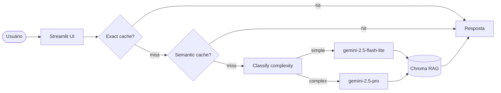

# 🔮 Holocron

> Chatbot de perguntas e respostas sobre os 6 filmes da saga Star Wars (Episódios I–VI), com RAG, cache semântico e model routing.

**Live demo:** https://holocron.streamlit.app/

## Problem statement

Fãs de Star Wars frequentemente querem consultar detalhes específicos dos filmes — falas, personagens, planetas, naves — mas navegar por wikis e roteiros manualmente é lento e impreciso. O Holocron resolve isso com um chatbot que responde perguntas em linguagem natural citando as fontes exatas. LLM + RAG é a abordagem certa porque o corpus é grande demais para caber no contexto, e o retrieval semântico garante que apenas os trechos relevantes sejam usados na geração.

## Arquitetura



## Corpus

| Fonte | Arquivos | Conteúdo |
|---|---|---|
| imsdb.com | 6 `.txt` | Roteiros completos dos Episódios I–VI |
| SWAPI (swapi.py4e.com) | 6 `.txt` | Personagens, planetas, naves, veículos, espécies e filmes |

Total: ~1.2 MB de texto indexado em Chroma com chunks de 800 tokens e overlap de 100.

## Setup

```bash
# 1. Clone o repositório
git clone <seu-repo>
cd holocron

# 2. Dependências
uv venv && source .venv/bin/activate  # Windows: .venv\Scripts\activate
uv sync

# 3. API key
cp .env.example .env
# edite .env com sua GEMINI_API_KEY

# 4. Gerar corpus
python build_corpus.py

# 5. Rodar local
streamlit run src/ui/streamlit_app.py
```

## Design decisions

- **Corpus em `.txt` separados por categoria:** facilita o `filter_by_source` — o LLM pode restringir a busca a roteiros ou à SWAPI dependendo da pergunta.
- **`chunk_size=800, overlap=100`:** tamanho suficiente para capturar diálogos completos nos roteiros sem perder contexto entre cenas.
- **`BATCH_SIZE=10` com `sleep(1)`:** respeita o rate limit de 1 req/s do Gemini free tier durante a indexação.
- **Routing heurístico:** queries com palavras como "explique", "compare" ou "analise" vão para o modelo premium; perguntas curtas e diretas usam o modelo barato. Em produção evoluiria para um classifier treinado.
- **`get_character_data` busca direta no txt:** dados estruturados da SWAPI (altura, massa, ano de nascimento) são recuperados por busca exata de nome, evitando falsos positivos do retrieval semântico.

## Limitations

- Cobre apenas os Episódios I–VI. Série The Mandalorian, Andor, Ahsoka e material Legends fora desses filmes não estão no corpus.
- Free tier do Gemini limita a 15 RPM, o que torna a indexação inicial lenta (~10 min para o corpus completo).

## Tech stack

- **LLM:** Gemini 2.5 Flash-Lite (default) / Gemini 2.5 Pro (queries complexas)
- **Embeddings:** gemini-embedding-001
- **Vector store:** Chroma local
- **UI:** Streamlit
- **Observability:** structured logs com trace_id
- **Deploy:** Streamlit Community Cloud

## Estrutura

```
holocron/
├── data/
│   ├── corpus/           # roteiros + SWAPI + enciclopédia
│   └── chroma/           # vector store (gitignored)
├── src/
│   ├── ui/streamlit_app.py
│   ├── pipeline/
│   │   ├── rag.py
│   │   ├── tools.py
│   │   ├── cache.py
│   │   └── routing.py
│   └── observability/trace.py
├── build_corpus.py
├── pyproject.toml
├── .env.example
└── README.md
```
-e 
---

*Desenvolvido por Gabriel Farias — disciplina "Desenvolvendo Software com IA Generativa" (Mod4 PPI).*
